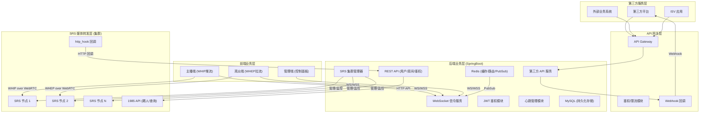
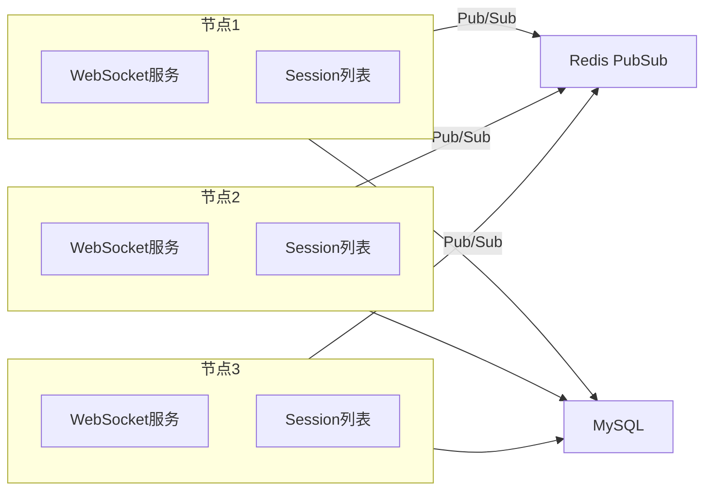
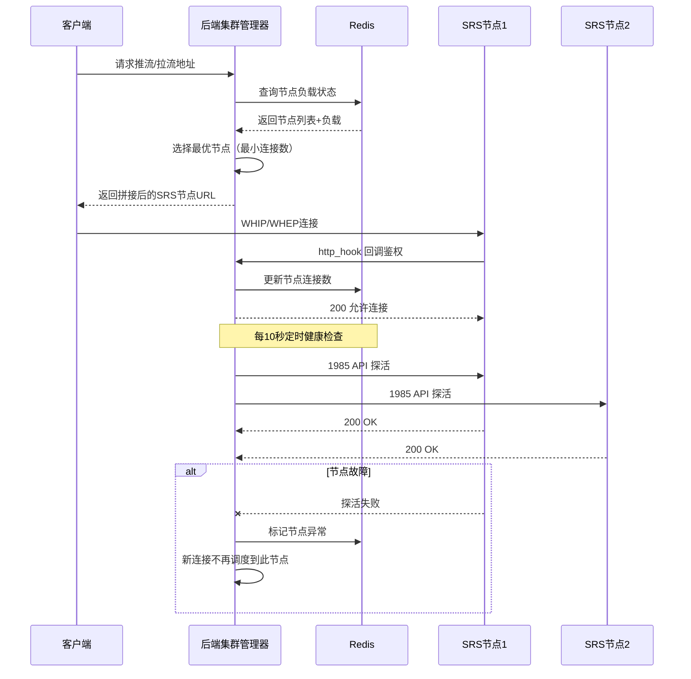
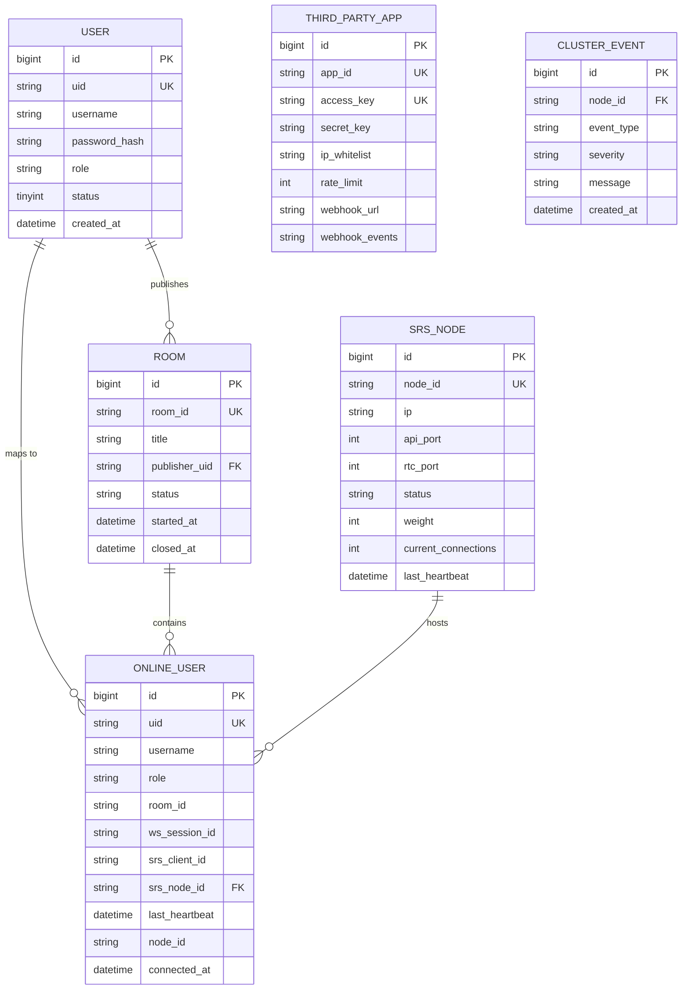

# SRS流媒体直播平台

产品需求文档 (PRD) · 版本 1.0

## 一、需求背景与目标

### 1.1 业务背景

当前直播技术生态中，SRS（Simple Realtime Server）作为高性能媒体转发服务器，在 WebRTC 推拉流领域具备成熟的协议支持能力。然而，SRS 官方提供的 Oryx 管理端在业务灵活性上存在明显短板：Oryx 将媒体转发、用户管理、直播间管理、数据存储等能力耦合在一起，无法满足**自研业务层完全控制直播间逻辑、用户体系、权限模型**的需求。

在实时互动场景中，**业务信令与媒体流的解耦**是架构设计的核心挑战。SRS 原生基于 HTTP 回调（on_publish / on_play / on_stop）的离线通知机制存在延迟高、回调丢失等缺陷，尤其当浏览器直接关闭或网络瞬间断开时，on_stop 回调可能延迟数分钟甚至完全丢失，无法满足实时在线状态管理的精度要求。

> **核心痛点：** 业界缺乏一套将 SRS 作为纯媒体网关、自研完整业务信令与用户管理体系的直播架构参考。现有方案要么过度依赖 SRS Oryx 导致业务耦合，要么基于 HLS 协议无法感知观众在线状态。

### 1.2 需求目标

本 PRD 定义一套**三层解耦架构**的直播平台：

- **前端业务层** — 负责主播推流开播、观众观看、直播间交互的 UI 与客户端逻辑
- **自研 SpringBoot 后端业务层** — 负责用户管理、直播间管理、鉴权、WebSocket 信令服务、心跳保活、踢人/关播等全部业务逻辑
- **SRS 媒体转发层** — 作为纯媒体网关，仅负责 WebRTC WHEP/WHIP 推拉流、RTMP 转发、媒体连接管理，无任何业务存储

通过这套架构，实现**业务信令与媒体流完全解耦**，摒弃 HLS 协议，全程使用 WebRTC WHEP/WHIP 协议，由自研 WebSocket 服务承载心跳保活、在线列表广播、管理指令下发三大核心能力。

### 1.3 量化目标

≤ 5s — 用户离线感知延迟

45s — 心跳超时阈值（3次心跳丢失）

99.9% — WebSocket 消息可靠送达率

0 — 依赖 SRS Oryx 业务管理能力

## 二、用户角色与场景

### 2.1 角色定义

| 角色 | 标识 | 核心职责 | 权限边界 |
|------|------|----------|----------|
| 主播 | `publisher` | WebRTC WHIP 推流开播、查询本房间在线列表、踢除本房间观众、修改直播间信息、关播 | 仅操作自己创建的直播间，不可跨房间 |
| 观众 | `audience` | WebRTC WHEP 拉流观看、发送弹幕/礼物等互动 | 仅加入和观看直播间 |
| 管理员 | `admin` | 踢人、关播、查询在线列表、系统管理、跨房间管理 | 跨房间管理权限，不受房间归属限制 |

### 2.2 核心场景

#### 场景一：主播开播

主播进入直播间页面，点击"开始直播"按钮。后端校验用户角色为 publisher，生成带 JWT 的 WHIP 推流地址。主播浏览器通过 WHIP 协议向 SRS 推流，SRS 通过 http_hook 回调后端完成鉴权与 client_id 绑定。推流成功后，后端通过 WebSocket 广播直播间状态变更为"直播中"，观众端自动切换为播放状态。

#### 场景二：观众观看

观众进入直播间列表，点击目标直播间。后端校验观众身份，生成带 JWT 的 WHEP 拉流地址。观众浏览器通过 WHEP 协议从 SRS 拉流，SRS 回调后端完成鉴权绑定。同时，观众 WebSocket 连接加入房间频道，开始接收在线列表广播、心跳保活。

#### 场景三：管理员踢人

管理员在管理后台查看直播间在线列表，定位到目标观众，点击"踢出"。后端首先调用 SRS 1985 API 断开该观众的媒体连接，然后通过 WebSocket 向该观众下发踢出通知，前端强制关闭播放器并退出直播间。操作完成后，后端刷新在线列表并通过 WebSocket 广播更新。

#### 场景四：主播管理直播间

主播在直播进行中，通过直播间的管理面板查看当前在线观众列表，对违规观众执行"踢出"操作。后端校验主播身份及其与直播间的归属关系后，调用 SRS 1985 API 断开目标观众的媒体连接，同时通过 WebSocket 向该观众下发踢出通知。主播还可修改直播间标题、设置直播间公告等基础信息，所有操作仅限主播自己的直播间，不可跨房间操作。

#### 场景五：断线重连

用户因网络波动导致 WebSocket 断开。前端采用指数退避策略（1s → 2s → 4s → 8s）自动重连。重连成功后，后端根据 uid 恢复用户会话绑定，重新加入房间频道，恢复在线状态。若 WebSocket 在 45 秒内未重连成功，后端判定用户离线，清理在线状态并广播下线通知。媒体流不受 WebSocket 断连影响，用户重连后无需重新拉流。

## 三、术语表

| 术语 | 全称 | 说明 |
|------|------|------|
| `SRS` | Simple Realtime Server | 高性能流媒体服务器，本方案中仅作为纯媒体网关 |
| `WHIP` | WebRTC-HTTP Ingestion Protocol | WebRTC 推流协议，主播端用于向 SRS 推送音视频流 |
| `WHEP` | WebRTC-HTTP Egress Protocol | WebRTC 拉流协议，观众端用于从 SRS 拉取音视频流 |
| `JWT` | JSON Web Token | 用户身份令牌，携带 uid、username、role 等声明，用于鉴权 |
| `WebSocket` | — | 自建业务信令通道，承载心跳、在线广播、管理指令三大能力 |
| `Redis PubSub` | Publish/Subscribe | 集群模式下跨节点消息广播的消息中间件机制 |
| `http_hook` | — | SRS 的事件回调机制，当推流/拉流/断流时向指定 URL 发送 HTTP 请求 |
| `client_id` | — | SRS 为每个媒体连接分配的唯一标识，用于后续操作（如踢人） |

## 四、系统架构总览

### 4.1 三层架构模型

系统采用严格的三层分离架构，**媒体流与业务信令完全解耦**，各层职责清晰互不侵入：



图 1：系统三层架构总览

### 4.2 数据流路径

**媒体流路径**

主播 `WHIP` → SRS 媒体层 → `WHEP` 观众。全程 WebRTC 协议，无 HLS 介入。

**信令流路径**

客户端 `WebSocket` → 自研后端。心跳、在线广播、管理指令均通过此通道。

**鉴权流路径**

客户端携带 JWT → SRS http_hook 回调后端 → 后端解析 token 完成鉴权绑定。

**管理流路径**

管理端/主播端 → 后端 REST API（校验房间归属） → 后端调用 SRS 1985 API 断流 + WebSocket 推送通知。主播操作仅限自己直播间，管理员可跨房间。

**第三方 API 路径**

第三方平台 → API Gateway（鉴权/限流） → 后端第三方 API 服务 → 业务处理 → 可选 Webhook 回调通知第三方。

**SRS 集群管理路径**

后端 SRS 集群管理器 → 定时健康检查/负载采集 → SRS 节点 1985 API → 节点状态上报 → 节点自动注册/摘除。

> **硬性约束：** SRS 仅作为纯媒体网关，**不存储任何业务数据**，不依赖 SRS Oryx 任何业务管理能力，不启用 HLS 协议。所有业务数据、用户体系、权限管理全部自研。

## 五、功能需求详情

以下为系统核心功能模块，每个模块包含交互说明、业务逻辑、规则约束。本 PRD 采用 Style 1 结构，按功能模块组织。

### 5.1 直播间基础能力

#### 功能概述

直播间是系统的核心业务单元，提供**房间维度隔离**能力，每个直播间拥有独立的在线用户列表、直播状态、媒体流。直播间支持创建、进入、退出、关闭等生命周期管理，所有操作均通过后端 REST API 完成，SRS 不感知直播间概念。

#### 业务逻辑

- **直播间创建**：主播通过前端发起创建直播间请求，后端校验主播身份后创建房间记录，返回房间 ID 和推流地址。
- **直播间进入**：用户通过房间 ID 进入直播间，后端校验用户权限（主播只能进入自己的房间、观众可进入公开房间）。
- **直播状态管理**：直播间状态包括 `等待中`、`直播中`、`已关闭`。仅主播可发起"开播"和"关播"操作。
- **房间隔离**：WebSocket 消息严格按房间维度隔离，用户仅接收当前所在房间的消息，禁止跨房间越权。
- **主播管理面板**：主播在直播过程中可通过管理面板查看本房间在线观众列表（用户名、uid、在线时长）、踢出违规观众、修改直播间标题/公告等基础信息。所有操作后端校验房间归属关系，仅限主播自己的直播间。

#### 直播间状态流转

| 当前状态 | 触发操作 | 下一状态 | 说明 |
|----------|----------|----------|------|
| 等待中 | 主播点击"开始直播"，后端生成 WHIP 推流地址 | 直播中 | 推流成功后 WebSocket 广播状态变更 |
| 直播中 | 主播点击"结束直播" | 已关闭 | 后端调用 SRS API 踢除主播推流连接 |
| 直播中 | 管理员强制关播 | 已关闭 | 同上，管理端操作 |
| 直播中 | 主播心跳超时 45s | 已关闭 | 系统自动判定主播离线后自动关播 |
| 已关闭 | — | — | 终态，不可逆，需重新创建直播间 |

#### 权限规则

| 操作 | 主播 | 观众 | 管理员 |
|------|------|------|--------|
| 创建直播间 | 是 | 否 | 是 |
| 进入直播间 | 是（仅自己的） | 是 | 是（所有房间） |
| 开播/关播 | 是 | 否 | 是（关播） |
| 踢除观众 | 是（仅自己房间） | 否 | 是 |
| 查询在线列表 | 是（仅自己房间） | 否 | 是（所有房间） |
| 修改直播间信息 | 是（仅自己房间） | 否 | 是（所有房间） |

### 5.2 用户身份与鉴权体系

#### 功能概述

建立统一的 JWT 鉴权体系，确保**所有推拉流地址不携带明文用户信息**，所有敏感信息通过 JWT 令牌加密传递。SRS 通过 http_hook 回调后端，由后端解析 token 完成用户身份识别与角色绑定。

#### 业务逻辑

- **JWT 令牌生成**：用户登录成功后，后端生成短期有效（建议 2 小时）的 JWT 令牌，包含 `uid`、`username`、`role` 三个声明。
- **推拉流 URL 拼接**：前端获取推流/拉流地址时，后端返回携带 `?token=xxx` 参数的完整 URL，避免前端自行拼接。
- **SRS 鉴权回调**：SRS 配置 `on_publish`、`on_play`、`on_stop` 回调地址指向后端，后端在回调中：
  - 解析 token 获取 uid、username、role
  - 校验 token 有效性（签名、过期时间）
  - 校验角色权限（publisher 只能推流，audience 只能拉流）
  - 记录 SRS client_id 与业务 uid 的双向映射关系
  - 返回 200 允许连接或 403 拒绝连接
- **WebSocket 握手鉴权**：WebSocket 连接建立时，在 URL 中携带 JWT token，后端在握手阶段校验 token，非法或过期 token 直接拒绝连接。

#### JWT 令牌结构

```
{
  "sub": "uid_1234567890",
  "username": "streamer_zhang",
  "role": "publisher",
  "iat": 1692678480,
  "exp": 1692685680
}
```

签名算法：HS256，密钥仅存于后端配置，不对外暴露

### 5.3 推拉流能力

#### 功能概述

基于 WebRTC WHEP/WHIP 协议实现**低延迟直播推拉流**，完全摒弃 HLS 协议。主播端通过 WHIP 协议推流，观众端通过 WHEP 协议拉流，SRS 作为媒体层负责流媒体转发和分发。

#### 业务逻辑

- **推流流程**：主播点击"开始直播" → 后端生成 WHIP 推流 URL（含 JWT） → 前端通过 WebRTC API 获取本地媒体流 → 使用 WHIP 客户端向 SRS 发起推流 → SRS 通过 on_publish 回调后端鉴权 → 推流成功。
- **拉流流程**：观众进入直播间 → 后端生成 WHEP 拉流 URL（含 JWT） → 前端使用 WHEP 客户端从 SRS 拉流 → SRS 通过 on_play 回调后端鉴权 → 拉流成功，视频渲染到播放器。
- **流断开**：用户主动退出或 WebSocket 心跳超时导致离线，后端调用 SRS 1985 API 删除对应 client_id 的连接，释放媒体资源。

> **重要：** 禁止 WebSocket 断开后立即踢除媒体流，必须等待 45 秒心跳超时后再执行断流操作，兼容网络抖动场景。

### 5.4 在线状态管理

#### 功能概述

采用**双链路保活机制**，以自建 WebSocket 心跳作为核心在线判定依据，SRS 媒体连接回调作为兜底校验，确保浏览器关闭、页面退出、网络断开、进程杀死等场景均可实时感知离线。

#### 业务逻辑

- **心跳机制**：前端每 15 秒发送 `{"type": "ping"}` 消息，后端收到后更新该用户的心跳时间戳。
- **超时判定**：后端每 10 秒扫描一次在线用户列表，若最后心跳时间距当前时间超过 45 秒，则判定用户离线。
- **离线处理**：判定离线后，后端清理在线状态、关闭 WebSocket 连接、调用 SRS API 断开媒体流（若存在）、WebSocket 广播下线通知。
- **SRS 兜底校验**：SRS 的 on_stop 回调作为辅助判定，当 WebSocket 心跳机制失效时，SRS 的媒体连接断开事件可作为兜底触发离线清理。

> **设计目标：** 心跳容错 45 秒窗口，规避网络抖动导致的误判离线。双兜底校验确保在线状态准确率 ≥ 99.9%。

#### 心跳处理时序

```mermaid
    sequenceDiagram
      participant Client as 客户端
      participant WS as WebSocket服务
      participant Cache as Redis缓存
      participant SRS as SRS媒体层

      Client->>WS: send {"type":"ping"} (每15s)
      WS->>Cache: 更新心跳时间戳
      Cache-->>WS: OK
      WS-->>Client: send {"type":"pong"}

      Note over WS,Cache: 每10s执行一次超时扫描

      WS->>Cache: 扫描所有在线用户
      Cache-->>WS: 返回用户列表+心跳时间
      alt 心跳时间 &gt; 45s
        WS->>SRS: 调用API断开媒体流
        WS->>Client: 主动关闭WS连接
        WS->>Cache: 清理在线状态
        WS->>WS: 广播下线通知
      end
```

图 2：心跳保活与超时处理时序

### 5.5 WebSocket 信令服务

#### 功能概述

自建 WebSocket 服务承载三大核心能力：**用户心跳保活**、**直播间在线列表实时广播**、**管理指令下发**。支持房间隔离消息推送、消息 ack 应答、离线消息补发、多实例集群部署。

#### 业务逻辑

##### 5.5.1 消息类型定义

| 方向 | 消息类型 | 说明 | 频率限制 |
|------|----------|------|----------|
| 上行 | `ping` | 客户端心跳保活 | 每 15s 一次，超出频率限制拒绝 |
| 下行 | `pong` | 服务端心跳应答 | — |
| 下行 | `room_user_list` | 直播间在线列表广播 | 用户进出房间时触发 |
| 下行 | `room_status_change` | 直播间状态变更通知 | 开播/关播时触发 |
| 下行 | `kick_notification` | 踢出通知 | 管理员操作时触发 |
| 下行 | `reconnect_command` | 服务重启重连指令 | 服务平滑重启前下发 |

##### 5.5.2 房间隔离机制

每个 WebSocket 连接在建立并鉴权后，根据用户进入的房间 ID，将该连接加入对应的房间频道。消息推送时，仅向当前房间内的所有连接广播，严格禁止跨房间消息传递。后端维护 `room_uid → Set<WebSocketSession>` 的映射关系。

##### 5.5.3 消息可靠送达

- **ACK 应答**：对于管理指令（如踢人通知），服务端发送后等待客户端 ack 确认，超时未 ack 则重试 3 次。
- **离线消息补发**：用户断线重连后，从 Redis 离线消息队列读取未消费的消息并补发。
- **僵死连接清理**：后端 60 秒无读写自动关闭无效 WebSocket 连接，释放资源。

##### 5.5.4 集群部署

WebSocket 支持多实例部署，无需 Nginx ip_hash 粘性会话。采用 **Redis PubSub** 实现跨节点消息广播，每个节点订阅 Redis 频道，当某节点需要向全房间推送消息时，先发布到 Redis PubSub，所有节点收到后向各自维护的该房间连接推送。



图 3：WebSocket 集群部署架构

### 5.6 直播间管理指令

#### 功能概述

后端自主实现直播开启、直播关闭、踢人、批量清空观众、查询在线列表、修改直播间信息等管理功能，**不依赖 SRS Oryx**。所有管理操作仅后端可执行，前端仅可发送 ping 心跳指令，严格遵循**指令白名单**原则。**主播**可在自己直播间内执行踢人、查询在线列表、修改直播间信息等管理操作，**管理员**拥有跨房间的完整管理权限。

#### 业务逻辑

##### 5.6.1 关播流程

1. 主播或管理员触发关播操作
2. 后端调用 SRS 1985 API `DELETE /api/v1/clients/{client_id}` 踢除主播推流连接
3. 后端通过 WebSocket 向该房间广播 `room_status_change: closed`
4. 观众端收到通知后关闭播放器，退出直播间
5. 后端更新直播间状态为"已关闭"，清理房间在线列表

##### 5.6.2 踢人流程

1. 管理员或主播（仅限自己的直播间）在管理端选择目标观众，发起踢出操作
2. 后端校验操作者身份与权限：管理员可跨房间操作，主播仅可操作自己房间的观众
3. 后端调用 SRS 1985 API 断开该观众的媒体连接
4. 后端通过 WebSocket 向该观众下发 `kick_notification`
5. 观众前端收到后强制关闭播放器，退出直播间，跳转至直播间列表页
6. 后端刷新房间在线列表，WebSocket 广播更新

##### 5.6.3 管理指令约束

| 指令 | 执行者 | 触发方式 | SRS 联动 | WebSocket 联动 |
|------|--------|----------|----------|----------------|
| 开播 | 主播 | 前端按钮 → REST API | WHIP 推流 | 广播直播中状态 |
| 关播 | 主播/管理员 | 前端按钮 → REST API | DELETE /clients/{id} | 广播已关闭 + 踢出观众 |
| 踢人 | 主播/管理员 | 管理端点击 → REST API | DELETE /clients/{id} | 下发踢出通知 |
| 批量清空观众 | 管理员 | 管理端点击 → REST API | 批量 DELETE | 批量下发踢出通知 |
| 查询在线列表 | 主播/管理员 | 管理端 → REST API | GET /api/v1/clients | — |
| 修改直播间信息 | 主播/管理员 | 管理端 → REST API | — | 广播信息变更 |
| 查看集群状态 | 管理员 | 管理端 → REST API | 各节点 1985 API 探活 | — |

### 5.7 对外 API 服务

#### 功能概述

系统作为独立项目运行，需提供标准化的 **RESTful API** 供第三方平台、外部业务系统、ISV 应用集成调用。所有对外接口通过 API Gateway 统一暴露，支持 **AK/SK 签名鉴权**、**IP 白名单**、**调用频率限制**，并可选通过 **Webhook 回调** 将直播间状态变更、用户进出等事件实时推送给第三方。

#### 业务逻辑

##### 5.7.1 API 鉴权体系

- **AK/SK 签名机制**：第三方入驻时，系统为其分配 AccessKey（AK）和 SecretKey（SK）。每次 API 调用需使用 SK 对请求参数进行 HMAC-SHA256 签名，服务端校验签名合法性。
- **IP 白名单**：支持为每个第三方应用配置 IP 白名单，仅白名单内的 IP 可调用 API。
- **调用频率限制**：按第三方应用维度限制 API 调用频率（如 1000 次/分钟），超限返回 429 状态码。
- **API 密钥表**：MySQL 存储第三方应用信息，Redis 缓存 AK/SK 和频率计数器。

##### 5.7.2 对外 API 清单

| 分类 | API | 说明 | 权限 |
|------|-----|------|------|
| 直播间 | `POST /api/v1/rooms` | 创建直播间 | 主播/第三方 |
| 直播间 | `GET /api/v1/rooms/{roomId}` | 查询直播间详情 | 全部 |
| 直播间 | `GET /api/v1/rooms/{roomId}/users` | 查询在线用户列表 | 主播/管理员/第三方 |
| 直播间 | `PUT /api/v1/rooms/{roomId}` | 修改直播间信息 | 主播/管理员/第三方 |
| 直播间 | `DELETE /api/v1/rooms/{roomId}` | 关闭直播间 | 主播/管理员/第三方 |
| 用户 | `POST /api/v1/users` | 创建用户 | 管理员/第三方 |
| 用户 | `GET /api/v1/users/{uid}` | 查询用户信息 | 全部 |
| 媒体 | `GET /api/v1/streams` | 查询所有流状态 | 管理员/第三方 |
| 媒体 | `DELETE /api/v1/streams/{clientId}` | 断开指定流 | 管理员/第三方 |
| 集群 | `GET /api/v1/cluster/nodes` | 查询 SRS 集群节点列表 | 管理员/第三方 |
| 集群 | `GET /api/v1/cluster/overview` | 查询集群概览统计 | 管理员/第三方 |
| 集群 | `GET /api/v1/cluster/nodes/{nodeId}` | 查询节点详情 | 管理员/第三方 |
| 集群 | `GET /api/v1/cluster/nodes/{nodeId}/stats` | 查询节点状态统计 | 管理员/第三方 |
| 集群 | `GET /api/v1/cluster/events` | 查询集群异常事件 | 管理员 |

##### 5.7.3 Webhook 回调机制

- **事件订阅**：第三方可通过 API 订阅感兴趣的事件类型，包括：`room.created`、`room.closed`、`user.joined`、`user.left`、`stream.started`、`stream.stopped`。
- **回调投递**：事件发生时，系统向第三方注册的回调 URL 发送 HTTP POST 请求，body 包含事件类型、时间戳、完整 payload。
- **重试机制**：回调失败后采用指数退避重试（3s → 9s → 27s），最多重试 3 次，超过后标记为"投递失败"并记录日志。
- **签名校验**：回调请求携带签名头 `X-Signature`，第三方使用 SK 验证回调来源的合法性。

##### 5.7.4 API 响应规范

```
// 成功响应
{
  "code": 0,
  "message": "success",
  "data": { ... },
  "requestId": "req_xxx"
}

// 错误响应
{
  "code": 40001,
  "message": "invalid signature",
  "requestId": "req_xxx"
}
```

统一响应格式，所有接口返回标准 JSON 结构，requestId 用于链路追踪。

### 5.8 SRS 集群管理

#### 功能概述

系统需管理**多台 SRS 节点**组成的媒体转发集群，实现节点的自动注册、健康检查、负载均衡、故障摘除与恢复。后端通过 **SRS 集群管理器** 统一管理所有 SRS 节点的生命周期，对外屏蔽集群拓扑细节，业务层无需感知具体 SRS 节点。

#### 业务逻辑

##### 5.8.1 节点生命周期管理

| 阶段 | 操作 | 说明 |
|------|------|------|
| 注册 | SRS 节点启动后向后端注册，上报自身 IP、端口、能力标签 | 支持手动注册和自动发现两种模式 |
| 健康检查 | 后端每 10 秒向节点 1985 API 发送探活请求 | 连续 3 次失败标记为"异常" |
| 负载采集 | 采集节点 CPU 使用率、内存、连接数、推拉流路数 | 用于调度决策 |
| 故障摘除 | 异常节点从集群中摘除，不再分配新流 | 已有连接不受影响，直至自然断开 |
| 恢复上线 | 健康检查恢复后，节点重新加入集群 | 自动恢复，无需人工干预 |
| 下线 | 节点退役时，等待所有连接断开后摘除 | 支持优雅下线 |

##### 5.8.2 调度策略

当主播发起推流或观众发起拉流时，集群管理器根据以下策略选择最优 SRS 节点：

- **最小连接数优先**：优先选择当前活跃连接数最少的节点，均衡负载。
- **同节点亲和**：同一房间的主播推流和观众拉流尽量调度到同一 SRS 节点，减少跨节点转发。
- **故障节点排除**：健康检查失败的节点不参与调度，新连接自动分配到健康节点。
- **节点权重**：支持为不同节点配置权重，高性能节点承载更多流量。

##### 5.8.3 集群监控与告警

| 指标 | 采集方式 | 告警阈值 |
|------|----------|----------|
| 节点在线率 | 健康检查 | < 80% 触发告警 |
| 节点推流路数 | 1985 API /api/v1/streams | 单节点 > 80% 容量触发告警 |
| 节点拉流路数 | 1985 API /api/v1/clients | 单节点 > 80% 容量触发告警 |
| 节点 CPU | 节点自上报 | > 85% 触发告警 |
| 节点内存 | 节点自上报 | > 85% 触发告警 |
| 推流成功率 | on_publish 回调统计 | < 95% 触发告警 |
| 拉流成功率 | on_play 回调统计 | < 95% 触发告警 |

##### 5.8.4 集群下的流调度流程



图 5：SRS 集群流调度与健康检查时序

##### 5.8.5 集群状态查看

提供**集群全局状态大盘**，管理端和第三方可通过统一视图实时查看 SRS 集群的整体运行状况。集群状态数据聚合自各节点的健康检查结果、负载上报和流统计数据，支持实时刷新和趋势分析。

###### 5.8.5.1 集群概览视图

| 指标 | 数据来源 | 刷新频率 |
|------|----------|----------|
| 集群总节点数 / 在线节点数 / 异常节点数 | srs_node 表 + 健康检查 | 实时 |
| 集群总推流路数 / 总拉流路数 | 各节点 1985 API 聚合 | 10s |
| 集群总在线观众数 / 总主播数 | Redis online 集合 | 实时 |
| 集群总带宽使用量 (Mbps) | 各节点上报 | 10s |
| 集群健康评分 | 综合各节点在线率、负载、流成功率计算 | 30s |

###### 5.8.5.2 单节点详情视图

| 信息类别 | 字段 | 说明 |
|----------|------|------|
| 基本信息 | 节点 ID、IP、API 端口、RTC 端口、注册时间 | 节点元数据 |
| 运行状态 | 状态（active/inactive/removing）、运行时长、最后心跳时间 | 节点存活状态 |
| 负载信息 | 当前连接数 / 最大连接数、连接使用率、CPU 使用率、内存使用率 | 节点资源占用 |
| 流统计 | 当前推流路数、当前拉流路数、累计推流总数、累计拉流总数 | 节点媒体处理能力 |
| 调度信息 | 节点权重、调度次数、当前承载房间数 | 调度决策参考 |
| 事件记录 | 最近状态变更时间、最近故障时间、故障次数 | 节点稳定性历史 |

###### 5.8.5.3 状态查看接口

| API | 返回数据 | 权限 |
|-----|----------|------|
| `GET /api/v1/cluster/overview` | 集群概览统计（节点数、流路数、在线数、带宽、健康评分） | 管理员/第三方 |
| `GET /api/v1/cluster/nodes` | 节点列表（含状态、负载、流统计的概要信息） | 管理员/第三方 |
| `GET /api/v1/cluster/nodes/{nodeId}` | 单节点完整详情（基础信息 + 运行状态 + 负载 + 流统计 + 调度信息 + 事件记录） | 管理员/第三方 |
| `GET /api/v1/cluster/nodes/{nodeId}/streams` | 节点上当前活跃的推拉流列表 | 管理员/第三方 |
| `GET /api/v1/cluster/events?type=error` | 集群异常事件记录（节点故障、连接失败、超时等） | 管理员 |

###### 5.8.5.4 管理端展示要求

- **集群仪表盘**：管理端首页提供集群概览仪表盘，以卡片形式展示集群总节点数、在线节点数、推流/拉流路数、健康评分，并附实时刷新按钮。
- **节点列表**：以表格形式展示所有节点，每行包含节点 ID、IP、状态（带颜色标签）、连接使用率（进度条）、CPU（进度条）、最后心跳时间。支持按状态筛选、按负载排序。
- **节点详情页**：点击节点进入详情页，展示全部信息类别，推拉流列表支持分页和搜索。
- **异常告警**：异常节点以红色高亮，列表顶部显示告警条数，支持一键跳转异常节点详情。
- **趋势图**：每个节点展示近 1 小时/6 小时/24 小时的连接数变化趋势折线图，便于运维人员分析负载变化规律。

## 六、非功能需求

### 6.1 稳定性需求

| 需求项 | 规格 | 说明 |
|--------|------|------|
| 心跳间隔 | 15s | 前端定时发送 ping 消息 |
| 心跳超时 | 45s | 连续 3 次心跳丢失判定离线，容错网络抖动 |
| 断线重连 | 指数退避 1s → 2s → 4s → 8s | 最大间隔 8s，避免集群雪崩 |
| 僵死连接清理 | 60s 无读写自动关闭 | 后端清理无效 WebSocket 连接 |
| SRS 空闲超时 | peer_idle_timeout=30s | SRS 配置，加速僵尸媒体连接清理 |
| SRS ICE 超时 | stun_timeout=20s | 快速清理断裂的 WebRTC 连接 |
| 平滑重启 | 下发重连指令 | 服务重启前通知客户端重连，业务信令无感迁移 |
| 双兜底校验 | WebSocket 心跳 + SRS 客户端列表轮询 | 双重校验用户在线状态 |

### 6.2 安全性需求

| 需求项 | 要求 | 强制等级 |
|--------|------|----------|
| 传输加密 | 生产环境强制 WSS，禁止 WS 明文 | 强制 |
| 握手鉴权 | WebSocket 握手阶段校验 JWT，非法/过期 token 直接拒绝 | 强制 |
| Token 安全 | 短期有效 JWT，禁止 URL 明文传递用户信息 | 强制 |
| 指令白名单 | 前端仅可发送 ping，管理操作仅后端可执行 | 强制 |
| 限流防护 | 单 IP 连接频率限流 + 单客户端消息频率限流 | 推荐 |
| 权限隔离 | 严格校验直播间权限，禁止跨房间越权 | 强制 |
| 密钥隔离 | SRS 管理账号密码仅存后端配置，不对外暴露 | 强制 |

### 6.3 高可用与集群

| 需求项 | 方案 |
|--------|------|
| WebSocket 集群 | 多实例部署，无需 Nginx ip_hash 粘性会话 |
| 跨节点消息广播 | Redis PubSub 实现，解决多实例会话隔离 |
| 节点路由映射 | Redis 维护用户 → 节点映射关系 |
| 在线用户集合 | Redis Set 维护全局在线用户 |
| 离线消息队列 | Redis List 存储离线消息，重连后补发 |
| 心跳缓存 | Redis String 存储用户最后心跳时间戳 |
| 服务无状态化 | 以业务 uid 为唯一标识，不依赖 WebSocket sessionId |
| 水平扩容 | 支持水平扩容，故障节点自动剔除，用户重连漂移至健康节点 |

### 6.4 硬性技术约束

> 1. 禁止使用 SRS Oryx 管理端，仅保留 SRS 媒体转发和 1985 API 能力
> 2. 禁止依赖 SRS on_stop 回调作为唯一离线判定依据，仅作为兜底
> 3. 禁止使用 HLS 协议，全程仅使用 WebRTC WHEP/WHIP 协议
> 4. 禁止明文传输用户姓名、uid 等敏感信息，统一使用 JWT 鉴权
> 5. 禁止前端直接执行任何直播间管理操作，所有管理逻辑收敛到后端
> 6. 禁止 WebSocket 断开后立即踢除媒体流，必须等待 45 秒心跳超时
> 7. 禁止 SRS 存储任何业务数据，所有数据自研存储管理
> 8. 禁止 WebRTC 媒体信令与业务信令耦合，严格做到媒体层、业务层解耦
> 9. 生产环境必须关闭 WS 明文、开启 WSS 加密，开启 SRS API 鉴权

## 七、数据模型

以下为系统核心数据实体及其关系定义。MySQL 负责持久化存储，Redis 负责缓存与运行时数据。

### 7.1 MySQL 表结构

#### 用户表 (user)

| 字段 | 类型 | 约束 | 说明 |
|------|------|------|------|
| `id` | BIGINT | PK, AUTO_INCREMENT | 自增主键 |
| `uid` | VARCHAR(64) | UNIQUE, NOT NULL | 业务唯一用户标识 |
| `username` | VARCHAR(100) | UNIQUE, NOT NULL | 用户名 |
| `password_hash` | VARCHAR(255) | NOT NULL | 加密密码 |
| `role` | VARCHAR(20) | NOT NULL, DEFAULT 'audience' | 用户角色：publisher / audience / admin |
| `status` | TINYINT | NOT NULL, DEFAULT 1 | 状态：1-正常，0-禁用 |
| `created_at` | DATETIME | NOT NULL | 创建时间 |
| `updated_at` | DATETIME | NOT NULL, ON UPDATE | 更新时间 |

#### 直播间表 (room)

| 字段 | 类型 | 约束 | 说明 |
|------|------|------|------|
| `id` | BIGINT | PK, AUTO_INCREMENT | 自增主键 |
| `room_id` | VARCHAR(64) | UNIQUE, NOT NULL | 业务唯一房间标识 |
| `title` | VARCHAR(200) | NOT NULL | 直播间标题 |
| `publisher_uid` | VARCHAR(64) | NOT NULL | 主播 uid |
| `status` | VARCHAR(20) | NOT NULL, DEFAULT 'waiting' | 直播间状态：waiting / live / closed |
| `created_at` | DATETIME | NOT NULL | 创建时间 |
| `started_at` | DATETIME | NULL | 最近开播时间 |
| `closed_at` | DATETIME | NULL | 关播时间 |
| `updated_at` | DATETIME | NOT NULL, ON UPDATE | 更新时间 |

#### 在线用户映射表 (online_user)

| 字段 | 类型 | 约束 | 说明 |
|------|------|------|------|
| `id` | BIGINT | PK, AUTO_INCREMENT | 自增主键 |
| `uid` | VARCHAR(64) | UNIQUE, NOT NULL | 用户 uid |
| `username` | VARCHAR(100) | NOT NULL | 用户名 |
| `role` | VARCHAR(20) | NOT NULL | 角色：publisher / audience |
| `room_id` | VARCHAR(64) | NOT NULL | 所在房间 ID |
| `ws_session_id` | VARCHAR(128) | NULL | WebSocket 会话 ID |
| `srs_client_id` | VARCHAR(64) | NULL | SRS 媒体连接 client_id |
| `last_heartbeat` | DATETIME | NOT NULL | 最后心跳时间 |
| `node_id` | VARCHAR(64) | NOT NULL | 所属 WebSocket 节点 ID |
| `connected_at` | DATETIME | NOT NULL | 连接建立时间 |

#### SRS 节点表 (srs_node)

| 字段 | 类型 | 约束 | 说明 |
|------|------|------|------|
| `id` | BIGINT | PK, AUTO_INCREMENT | 自增主键 |
| `node_id` | VARCHAR(64) | UNIQUE, NOT NULL | 节点唯一标识 |
| `ip` | VARCHAR(64) | NOT NULL | 节点 IP 地址 |
| `api_port` | INT | NOT NULL | 1985 API 端口 |
| `rtc_port` | INT | NOT NULL | WebRTC 端口 |
| `status` | VARCHAR(20) | NOT NULL, DEFAULT 'active' | 节点状态：active / inactive / removing |
| `weight` | INT | NOT NULL, DEFAULT 10 | 调度权重 |
| `max_connections` | INT | NOT NULL, DEFAULT 1000 | 最大连接数 |
| `current_connections` | INT | NOT NULL, DEFAULT 0 | 当前活跃连接数 |
| `cpu_usage` | DECIMAL(5,2) | NULL | CPU 使用率 |
| `mem_usage` | DECIMAL(5,2) | NULL | 内存使用率 |
| `last_heartbeat` | DATETIME | NULL | 最后心跳时间 |
| `registered_at` | DATETIME | NOT NULL | 注册时间 |

#### 第三方应用表 (third_party_app)

| 字段 | 类型 | 约束 | 说明 |
|------|------|------|------|
| `id` | BIGINT | PK, AUTO_INCREMENT | 自增主键 |
| `app_id` | VARCHAR(64) | UNIQUE, NOT NULL | 应用唯一标识 |
| `app_name` | VARCHAR(200) | NOT NULL | 应用名称 |
| `access_key` | VARCHAR(128) | UNIQUE, NOT NULL | AK 访问密钥 |
| `secret_key` | VARCHAR(255) | NOT NULL | SK 签名密钥（加密存储） |
| `ip_whitelist` | TEXT | NULL | IP 白名单，JSON 数组 |
| `rate_limit` | INT | NOT NULL, DEFAULT 1000 | 每分钟调用上限 |
| `webhook_url` | VARCHAR(500) | NULL | 回调 URL |
| `webhook_events` | TEXT | NULL | 订阅事件列表，JSON 数组 |
| `status` | TINYINT | NOT NULL, DEFAULT 1 | 状态：1-启用，0-禁用 |
| `created_at` | DATETIME | NOT NULL | 创建时间 |

#### 集群事件记录表 (cluster_event)

| 字段 | 类型 | 约束 | 说明 |
|------|------|------|------|
| `id` | BIGINT | PK, AUTO_INCREMENT | 自增主键 |
| `node_id` | VARCHAR(64) | NOT NULL, INDEX | 关联节点 ID |
| `event_type` | VARCHAR(50) | NOT NULL, INDEX | 事件类型：node_down / node_up / connection_fail / timeout / capacity_warning |
| `severity` | VARCHAR(20) | NOT NULL | 严重程度：info / warning / critical |
| `message` | TEXT | NOT NULL | 事件描述信息 |
| `payload` | TEXT | NULL | 附加数据，JSON 格式 |
| `created_at` | DATETIME | NOT NULL, INDEX | 事件发生时间 |

### 7.2 Redis 缓存设计

| Key 模式 | 类型 | 说明 | TTL |
|----------|------|------|-----|
| `online:users` | Set | 全局在线用户 uid 集合 | 无（手动清理） |
| `room:{room_id}:users` | Set | 房间内在线用户 uid 集合 | 无（手动清理） |
| `user:{uid}:node` | String | 用户路由节点映射（节点 ID） | 60s（心跳续期） |
| `user:{uid}:heartbeat` | String | 用户最后心跳时间戳（毫秒） | 60s（心跳续期） |
| `user:{uid}:offline_msgs` | List | 离线消息队列（断线期间未消费的消息） | 300s |
| `ws:node:{node_id}:users` | Set | 某节点上所有在线用户 uid | 无（手动清理） |
| `srs:cluster:nodes` | Sorted Set | SRS 集群节点列表，按负载 score 排序 | 无（手动清理） |
| `srs:node:{node_id}:connections` | String | 节点当前活跃连接数 | 30s（节点心跳续期） |
| `api:rate:{app_id}` | String | 第三方 API 调用频率计数器 | 60s（滑动窗口） |
| `api:token:{app_id}` | String | 第三方临时访问令牌 | 3600s（1小时过期） |

### 7.3 实体关系图



图 4：核心实体关系图

## 八、SRS 配置规范

以下为 SRS 服务器的固定配置约束，确保 SRS 作为纯媒体网关的轻量化运行。

| 配置项 | 值 | 说明 |
|--------|-----|------|
| `http_api.enabled` | on | 开启 HTTP API，用于后端踢人/查询 |
| `http_api.auth` | on | 开启 API 鉴权，绑定固定账号密码 |
| `http_hooks.on_publish` | 后端 URL | 推流事件回调 |
| `http_hooks.on_unpublish` | 后端 URL | 停止推流事件回调 |
| `http_hooks.on_play` | 后端 URL | 拉流事件回调 |
| `http_hooks.on_stop` | 后端 URL | 停止拉流事件回调 |
| `rtc_server.enabled` | on | 开启 WebRTC 支持 |
| `rtc_server.protocol` | udp | WebRTC 使用 UDP 传输 |
| `peer_idle_timeout` | 30 | TCP 空闲超时 30 秒 |
| `stun_timeout` | 20 | STUN/ICE 超时 20 秒 |
| `hls.enabled` | off | 关闭 HLS 协议 |

> **注意：** SRS 管理账号密码仅存在于后端配置文件，不对外暴露，不参与前端交互。生产环境必须开启 WSS 加密传输。